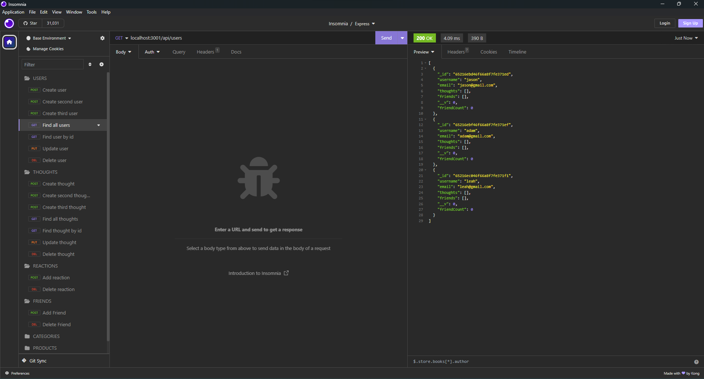
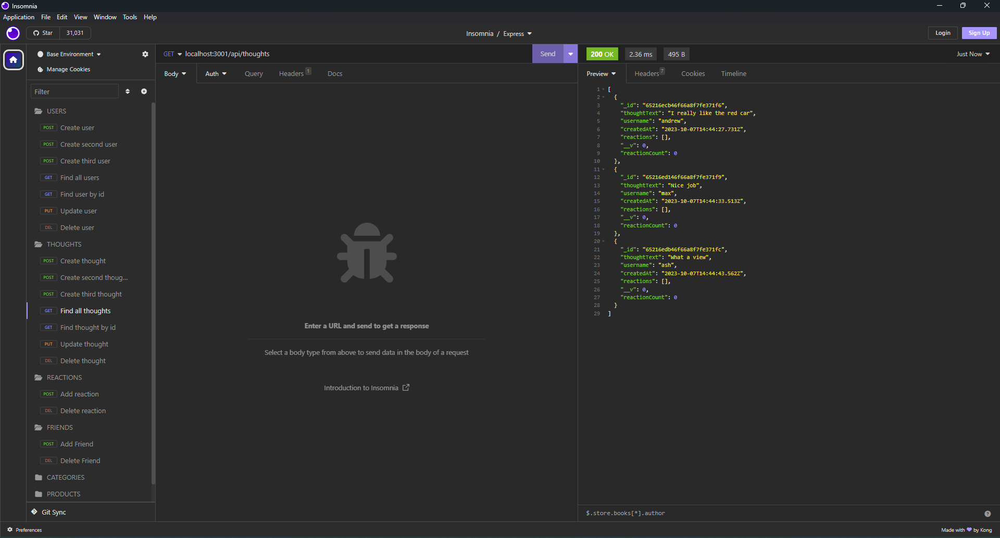

# social-network-api

## Description

A social network web application where you build your own API so that users can share their thoughts, react to friend's thoughts, and create a friend list.

## Table of Contents

* [Description](#description)
* [Installation](#installation)
* [Usage](#usage)
* [Walkthrough Video](#walkthrough-video)

## Installation

Clone repo and run the following lines of code in your terminal:
```
npm i
```
```
npm start
```

## Usage





## Walkthrough Video

[Link](https://drive.google.com/file/d/1-lvCK3rcU-DVT-wyKcM0bn64vCzr9bWV/view)